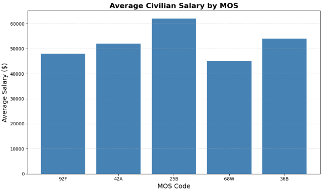
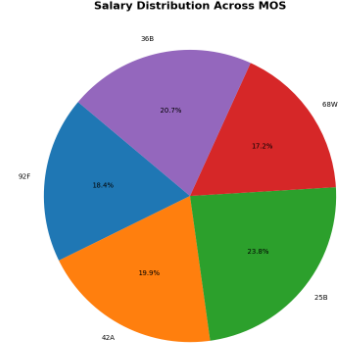

# MOS Mapper Documentation

## Project Purpose
MOS Mapper is an automated analytics tool designed to help Soldiers translate their Military Occupational Specialty (MOS) into civilian job insights. It processes MOS data, generates reports, and creates visual charts that summarize salary ranges, skills, and job market opportunities.

---

## How the Program Works
The application runs through a 10‑step automated pipeline:

1. Generate MOS‑specific reports
2. Generate salary summary
3. Generate skill summary
4. Generate job summary
5. Create salary bar chart
6. Create skill bar chart
7. Create job bar chart
8. Create salary pie chart
9. Create skill pie chart
10. Create job pie chart

Each step writes a `.txt` file or `.png` chart to the project directory.

## Visual Examples

### Average Salary Chart


### Salary by MOS Chart



---

## How to Run the Program
Use the following command in your terminal:

```powershell
uv run python -m datafun.app_mos_mapper
